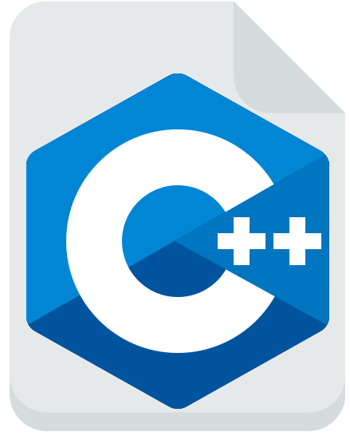
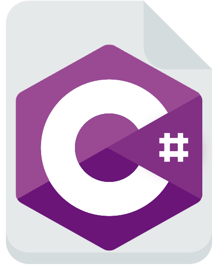

# [namespace ra {](https://ra101.github.io/namespace-ra/)


Prerequisite: One must be familiar with coding in `C++`. 

|Library|Article|Repo|
|---|---|---|
|Random Prime No. Genrator|[GH Page](https://ra101.github.io/Random-Prime-Number-Generator-Engine-cpp/)|[GitHub](https://github.com/ra101/Random-Prime-Number-Generator-Engine-cpp/)|
|RSA Cryptography|[GH Page](https://ra101.github.io/RSA-cpp/)|[GitHub](https://github.com/ra101/RSA-cpp/)|
|BlockChain|[GH Page](https://ra101.github.io/Generic-BlockChain-container-cpp/)|[GitHub](https://github.com/ra101/Generic-BlockChain-container-cpp/)|

These are coding practices one may follow to write readable good code.

---

### File Types:
Any programing file, in the end, is nothing but a text file with a fancy extension. In the Book of Genesis, the mentioned naming stylexe is:
- `.c` for `C`
- `.cpp` for `C++`
- `.h` for headers (independent of `C` or `C++`)

But due to the opensource nature of GNU, A bunch of different assembler and compilers were made which came with their own extensions variations, such as, `.cc`, `.C`, `.cxx`, `.c++` and `.hh`, `.H`, `.hxx`, `.hpp`, `.h++`.

TBH, Just chose one set of extensions, after all, even `.txt` can be compiled.

I use, (Since Most IDE recognize them):
- `.c` for `C`
- `.cpp` for `C++`
- `.h` for `C` headers
- `.hpp` for `C++` headers

---

### `makefile`:

A `makefile` is a special file, containing shell commands, that you create and name `makefile` (no extensions)

It is executed using the `make` command. My Typical makefile looks like this: 

```bash
# Variables
CXX=g++
CXXFLAGS=-std=c++11 -w

# <command> : <dependencies>

# would have worked with main.cpp as well, added rest of
# dependencies to add a check before compiler returns an error.
build: main.cpp local_header.hpp includes/external_lib.hpp 
	@echo "\n\nmain.cpp: Building..."
	$(CXX) $(CXXFLAGS) -o main.out main.cpp

run: main.out
	@echo "\n\nmain.cpp: Executing..."
	./main.out

clean: main.out
	@echo "\n\nmain.cpp: Cleaning..."
	rm main.out

# test command is for show, I have probably never used it 😅😂 
test: test.cpp
	@echo "\n\ntest.cpp: Building..."
	$(CXX) $(CXXFLAGS) -o test.out test.cpp
	@echo "\n\ntest.cpp: Executing..."
	./test.out
	@echo "\n\ntest.cpp: Cleaning..."
	rm ./test.out

all: build run clean
```

```bash
$ # To build, run and clean the main.cpp
$ make all
```

One can use something like [GNU Automake](https://www.gnu.org/software/automake/) or [CMake](https://cmake.org/) instead of hand-written makefiles. These tools may add the overhead of other files, but these files are informative files. Use these tools, if they benefit your project.

NOTE: use `-MMD` flag to get a `.d` file, containing all dependencies.

---

### PreProcessors:

The preprocessors are the directives, which instruct the compiler to preprocess the information before starting compilation. All preprocessors start with `#`, For example: `#include<iosteam>`

These are the coding practices, I use:

- Double Quotes (`"..."`) for including local headers, This rule increases readability of Code

- 3 Levels of includes (I picked this habit while working in python) with linespace between them.
   - First, for core `g++` system files.
   - Second, for externally added libraries.
   - Third, for locally created files.

As mentioned [here](https://stackoverflow.com/questions/2762568/c-c-include-header-file-order) one should include local headers first — _then_ system headers. The reason is to guarantee that all local headers are self-sufficient

"self-sufficient" means, local headers are not depending on System or External libraries of this file.
This although is a good way of checking, I believe this "check" is not something headers/compilers should do, well at least not at the file level.
In an ideal world, Each header would have its own test files to resolve this, until then, going against the natural order might not be that bad.

- `#pragma one` for **header files**
  - What `#include` does is that it adds the mentioned file at the top of the code (you can check it by using `--save-temp` flag during compiling) So, If a header file is called again somewhere else, The Whole Code will be compiled again. Since Header files don't typically initiate a variable. It is Advised to compile it once for performance enhancement.
 - One can use `#indef ... #include ... #endif`, but it is tedious, so`#pragma once` reduces possibilities for bugs due to manual mishandling.

- DO NOT USE `using namespace ...` in **header file**
  - It may lead to a re-declaration error.
  - It may populate the header file with its function


SO, According to the above rules, A good **header** would be.

```C++
#pragma once // 2 line-space afterwards


#include<system_file_1>
#include<system_file_2> // 1 line-space afterwards

#include<external_lib1_1> // 1 line-space afterwards
#include<external_lib2_2> // club external libs together
#include<external_lib2_3> // 1 line-space afterwards

#include "local_file" // 2 line-space afterwards


// using namespace ... DO NOT USE IN HEADERS

namespace ra {
...
}
```

---

### Nomenclature:

#### File | `namespace` | `Class` | `function`:
- Nothing is fixed, one may use `camelCase`, `PascalCase` or
 `snake_case`.
- I personally find `snake_case` to be more readable.

#### `Template` Parameter:
 - same as above, no rules.
 - I prefer `PascalCase` here.

#### Constants | Macros:
 - `UPPER_SNAKE_CASE` is preferred everywhere.

#### Variables:
- Before IDE(s) were a thing, People just couldn't hover over variables to get info. So some old libraries use the following conventions:
   - `m_<any case>` for private members
   - `t_<any case>` for function parameters
- I personally, discard this rule.


#### Taboo of Naming:
Check this [link](https://stackoverflow.com/questions/228783/what-are-the-rules-about-using-an-underscore-in-a-c-identifier)

---

### Comments:

C++ allows for 2 types of comments:

```C++
// This is single line Comment
```

```C++
/*
...
This is Multi-Line Comment
...
*/
```

Generally speaking, single-line comments provide more control over the appearance and are _considered_ better.

As a python developer, I wholehearted disagree, This is how I prefer my code!

```C++

class custom_class {
    /*
        A definition of what does this class represent
        - Preferred Usage:
            ...
    */
    private:
        // How this variable affects / Where this may be used
        float variable {3.14};

        // What does this function do
        void function();
}

void custom_class::function(){
    /*
        A definition of what does this function do
        - Input: ...
        - Output: ...
    */
}

```

---

### Custom Exceptions:

Custom exceptions provide you the flexibility to add attributes and methods that are not part of a standard programming language. These are most helpful in Debugging when code is unable to compile.

Below is My Favorite Exception:

```C++
// Code

namespace ra
{
    class external_exception : public std::logic_error
    {
    public:
        external_exception(
            std::string function = __builtin_FUNCTION()
        ) : std::logic_error("`" + function + "` called for external exception!"){};
    };
}

```

```C++
// Usage

void main (){ throw ra::external_exception(); }
```

```bash
# Output

terminate called after throwing an instance of 'ra::external_exception'
  what():  `main` called for external exception!
```


Let me explain, In argument of constructor of exception it says:
```C++
std::string function = __builtin_FUNCTION()
```

`__builtin_FUNCTION()` return the source location, when called.

Since called in Argument, whenever it is initiated that is the source location, Essentially Making it a traceable Exception


Here We have inherited from `logic_error`, but other exceptions/errors could be found [here](https://en.cppreference.com/w/cpp/header/stdexcept)

NOTE: In C++ Exceptions and Errors are the same, but in theory, Exceptions are something that could be handled, whereas errors should not be as they break the system.

---


### Modularity:

A Modular design is shown to improve the design process by allowing better re-usability, relatively low maintenance, workload handling, and easier debugging processes. Modularity in `C++` can be achieved by the following 

#### Template
As defined [here](https://www.javatpoint.com/cpp-templates):  A C++ template is a powerful feature added to C++. It allows you to define the generic classes and generic functions and thus provides support for generic programming. Generic programming is a technique where generic types are used as parameters in algorithms so that they can work for a variety of data types

Templates can be represented in two ways:
 - [Function templates](https://en.cppreference.com/w/cpp/language/function_template)

```C++
template <typename TemplateKlass>
TemplateKlass get_maximum(TemplateKlass x, TemplateKlass y){
   return (x > y)? x: y;
}
```

 - [Class templates](https://en.cppreference.com/w/cpp/language/templates)
```C++
template <typename TemplateKlass>
class custom_class {
private:
    TemplateKlass x, y;
public:
    custom_class(TemplateKlass, TemplateKlass);
};
```


I am will not into details, As there are far better resources


#### Function as Argument:
We can pass a function in the argument of another function, Well Actually A function pointer is passed to be exact. This comes in handy in the situation, where you have multiple services for the same request, for example, **Hashing**, you can use so many third-party algorithms for hashing.

```C++
bool verify_hash(std::string (*hash_func)(std::string)){
    /*
        This will take in any function with
        input and output as a string 
    */
    return hashed_output == hash_func(input)
}
```


#### Inheritance

I picked up this in my `Unity3D` days, In `Unity3D` Almost everything is inherited and then used.

The plan is Simple, Create a class with a bunch of public members all throwing error.

And Then Everyone would have to Inherit that class and override it.

For Example

```C++
class base_class{
    /*
        Everyone will inherit from this class
    */
public:
    base_class(){}
    base_class(float) {throw not_implemented_exception();}

    virtual operator string() const = 0;

    bool operator<(const base_class &other) const { throw not_implemented_exception(); }

    template <typename TemplateKlass>
    void some_func(TemplateKlass temp) {throw not_implemented_exception();}
}
```


```C++
class extended_class : public base_class{
    /*
        This is how Inheritance would work
    */
private:
    float m_temp;
public:
    extended_class(){}
    extended_class(float t_temp) : m_temp(t_temp)

    operator std::string() {return to_string(t_temp);}

    bool operator<(const extended_class &other) const { m_temp < other.m_temp }

    template <typename TemplateKlass>
    void some_func(TemplateKlass temp) {...}
}
```

---

### Bonus: Icon Pack!

Yeah... I created my own icons too...
<div width=100%>

| GNU Extension |                Preview                |          Download           |
| :------------ | :-----------------------------------: | :-------------------------: |
| .c            |    |   [c.ico](./assets/c.ico)   |
| .cpp          |  | [cpp.ico](./assets/cpp.ico) |
| .cs           |   |  [cs.ico](./assets/cs.ico)  |
| .h / .hpp     |    |   [h.ico](./assets/h.ico)   |

</div>

---


|Library|Article|Repo|
|---|---|---|
|Random Prime No. Genrator|[GH Page](https://ra101.github.io/Random-Prime-Number-Generator-Engine-cpp/)|[GitHub](https://github.com/ra101/Random-Prime-Number-Generator-Engine-cpp/)|
|RSA Cryptography|[GH Page](https://ra101.github.io/RSA-cpp/)|[GitHub](https://github.com/ra101/RSA-cpp/)|
|BlockChain|[GH Page](https://ra101.github.io/Generic-BlockChain-container-cpp/)|[GitHub](https://github.com/ra101/Generic-BlockChain-container-cpp/)|

# [}](https://ra101.github.io/namespace-ra/)
